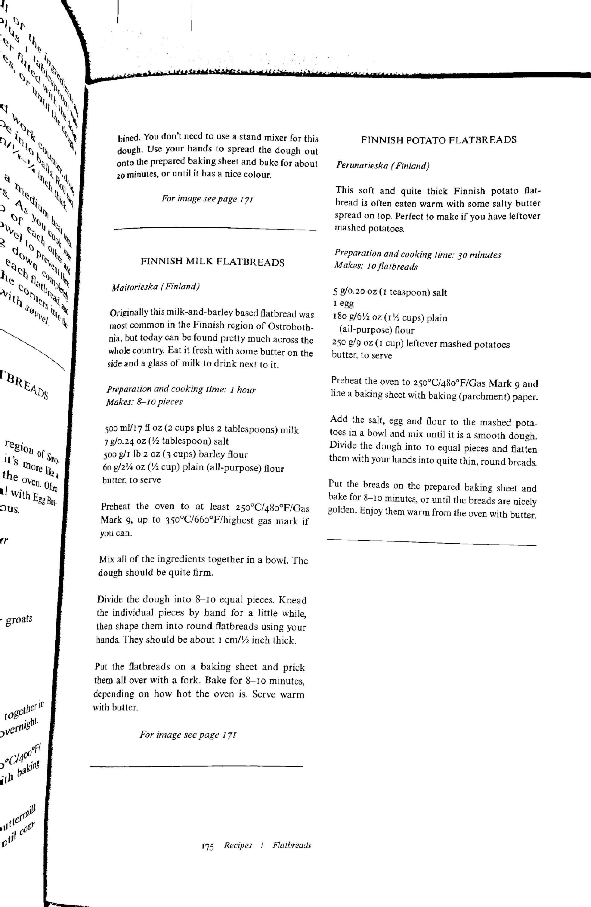
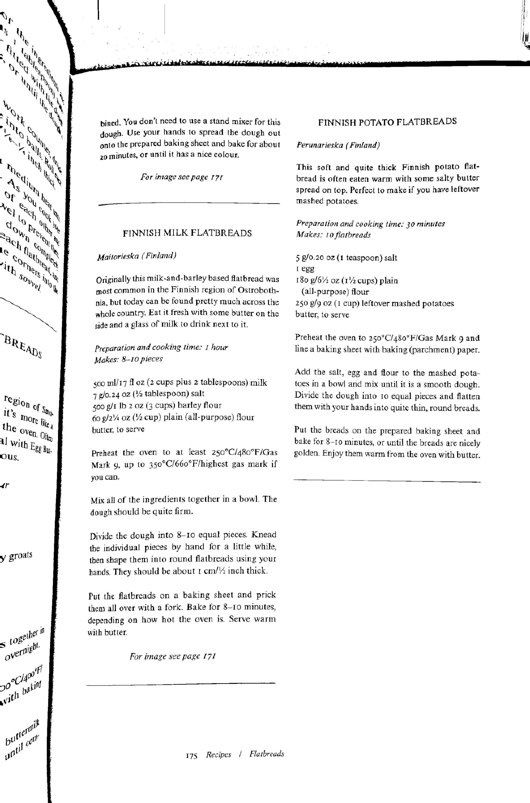

# page-dewarp-js

A JavaScript implementation of the [`page-dewarp` library](https://github.com/lmmx/page-dewarp), using [`opencv-wasm`](https://www.npmjs.com/package/opencv-wasm) bindings.

Automatically detects curved page boundaries, estimates 3D shape, and generates flattened output images.

> [!IMPORTANT]
> This repository is the result of an LLM Agent experiment. I did not write any of the code directly. Instead,
> I provided detailed plans describing the general approach, and asked the agent to produce a JavaScript port
> of the Python library, making use of benchmarking tools and architecture comparisons. After a few evenings
> of iteration, the results are sufficiently good. While the pre-selected difference metric thresholds were
> not met, the visual results are convincing.

| Input                 | Python Output                  | JavaScript Output      |
| --------------------- | ------------------------------ | ---------------------- |
|  |  |  |

## Installation

```bash
npm install page-dewarp-js
```

## Development Setup

For benchmarking and debugging against the Python reference implementation, it's recommended to clone both repositories side by side:

```bash
git clone https://github.com/lmmx/page-dewarp.git
git clone <this-repository-url> page-dewarp-js
```

This structure allows comparison tools and scripts to access both implementations:

```
Development/
├── page-dewarp/          # Python reference implementation
└── page-dewarp-js/       # JavaScript implementation
```

## Basic Usage

### Command Line

Process an image with default settings:

```bash
node src/cli.js path/to/image.jpg
```

Output will be saved as `path/to/image_thresh.png`.

### Programmatic API

```javascript
import { loadOpenCV, WarpedImage } from "page-dewarp-js";

await loadOpenCV();

const warpedImage = new WarpedImage("input.jpg");
await warpedImage.process();
warpedImage.destroy();
```

For advanced usage, you can also import the configuration object:

```javascript
import { loadOpenCV, WarpedImage, Config, updateConfig } from "page-dewarp-js";

await loadOpenCV();

updateConfig({
  OUTPUT_ZOOM: 2.0,
  OUTPUT_DPI: 600,
});

const warpedImage = new WarpedImage("input.jpg");
await warpedImage.process();
warpedImage.destroy();
```

## CLI Options

### Debug Options

- `-d, --debug-level <level>` - Debug output level (0=none, 1=basic, 2=detailed)
- `-o, --debug-output <mode>` - Debug output mode: `file`, `screen`, or `both`
- `--max-screen-width <px>` - Maximum width for screen debug display (default: 1280)
- `--max-screen-height <px>` - Maximum height for screen debug display (default: 700)

### Output Options

- `-p, --pdf` - Convert output to PDF format
- `-z, --output-zoom <factor>` - Output zoom factor (default: 1.0)
- `--output-dpi <dpi>` - Output DPI (default: 300)
- `--no-binary` - Skip binary thresholding on output (default: false)
- `-s, --shrink <factor>` - Shrink factor for remapping (default: 1)

### Page Detection

- `-x, --x-margin <percent>` - Horizontal page margin as % of page width (default: 5)
- `-y, --y-margin <percent>` - Vertical page margin as % of page height (default: 5)

### Text Contour Filtering

- `--min-text-width <px>` - Minimum text contour width (default: 15)
- `--min-text-height <px>` - Minimum text contour height (default: 2)
- `--min-text-aspect <ratio>` - Minimum text aspect ratio (default: 1.5)
- `--max-text-thickness <px>` - Maximum text blob thickness (default: 10)
- `--adaptive-winsz <px>` - Adaptive threshold window size (default: 55)

### Span Assembly

- `--min-span-width <px>` - Minimum span width in pixels (default: 250)
- `--span-spacing <px>` - Pixels between span sample points (default: 20)
- `--max-edge-overlap <ratio>` - Maximum allowed contour overlap (default: 1.0)
- `--max-edge-length <px>` - Maximum distance between contours (default: 100)
- `--edge-angle-cost <factor>` - Cost multiplier for angle differences (default: 10)
- `--max-edge-angle <degrees>` - Maximum angle between contours (default: 7.5)

### Optimization

- `--optim-max-iter <n>` - Maximum optimization iterations (default: 250)
- `--optim-tol <tol>` - Optimization tolerance (default: 1e-4)

### Camera Model

- `-f, --focal-length <px>` - Camera focal length in pixels (default: 1.2 × max(width, height))

## Examples

Process with debug output:

```bash
node src/cli.js -d 2 -o both example_input/book.jpg
```

Adjust text detection thresholds:

```bash
node src/cli.js --min-text-width 20 --max-text-thickness 12 input.jpg
```

Generate high-resolution output:

```bash
node src/cli.js --output-zoom 2 --output-dpi 600 input.jpg
```

## Documentation

See the `docs/` directory for detailed documentation:

- [algorithms.md](docs/algorithms.md) - Algorithm descriptions
- [architecture.md](docs/architecture.md) - System architecture
- [data_structures.md](docs/data_structures.md) - Key data structures
- [api-reference.md](docs/api-reference.md) - API reference
- [debugging.md](docs/debugging.md) - Debugging guide

## License

See [LICENSE](LICENSE) file.
